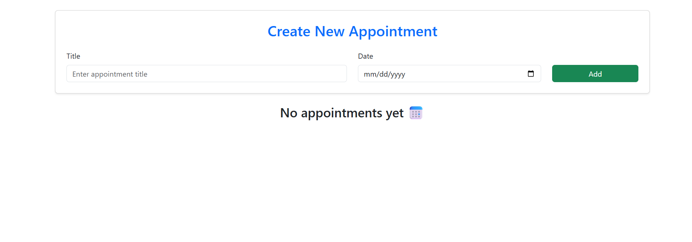
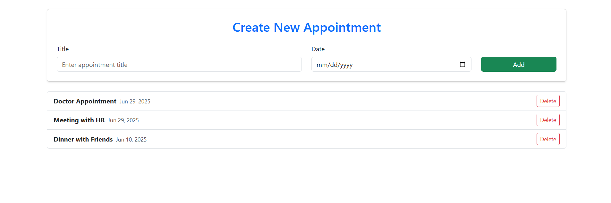

# 🚀 Day 1 - Appointment App

A small web app to practice component creation and data binding. The user can:

- Add new appointments
- Display the list of appointments
- Delete an appointment

## 📅 Topics Covered

- ✅ Installing Angular CLI and setting up the development environment
- ✅ Creating a new Angular project using the CLI
- ✅ Exploring the project structure
- ✅ Creating and using Components
- ✅ Data Binding (Interpolation, Property, Event, Two-way)
- ✅ Angular CLI basics

---

## 🖼️ Screenshots

