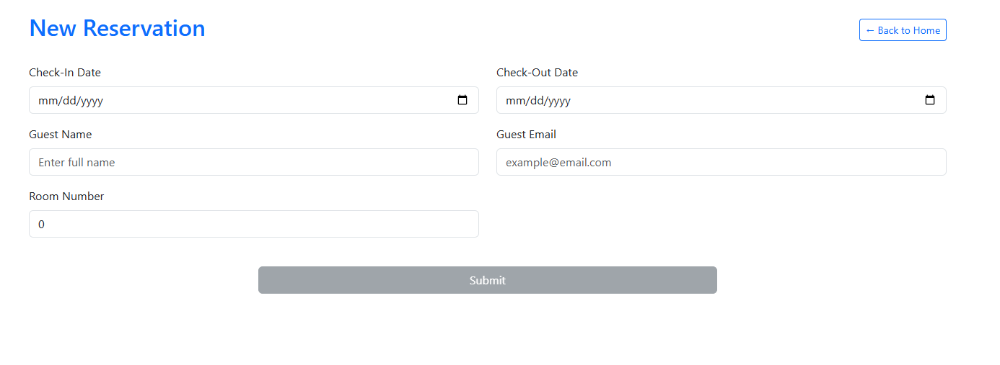
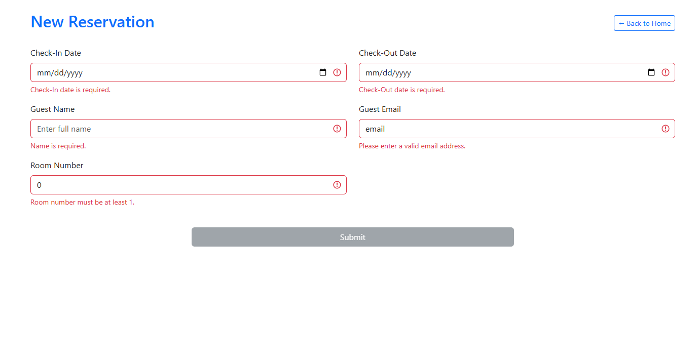
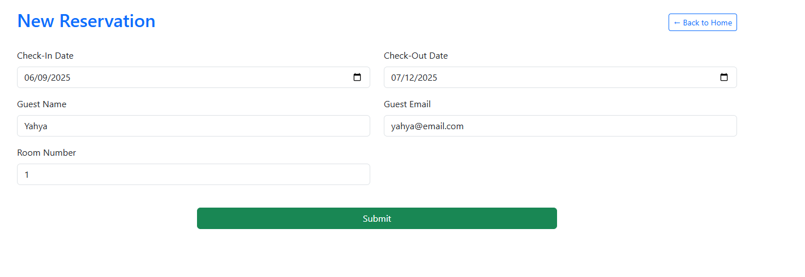
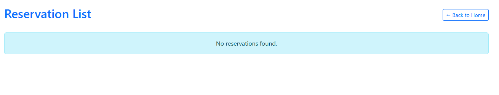
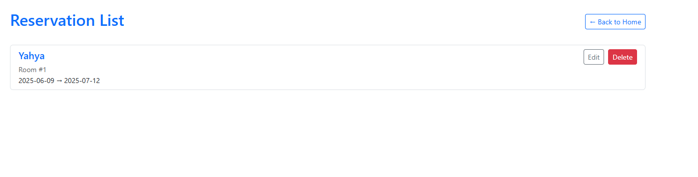
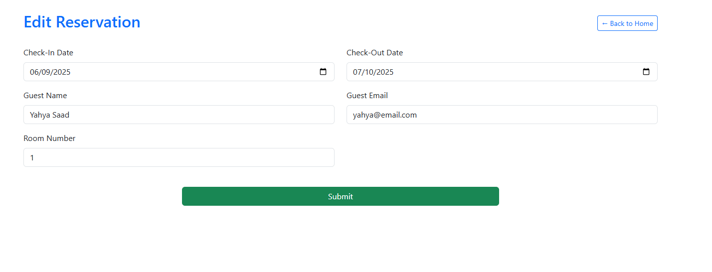

# 🚀 Day 2 – Reservation App

A CRUD web app built with Angular to practice **Forms**, **Routing**, and **Services**.

---

## 📌 Features

- ✅ Create new reservations (Check-in/out dates, Guest Name, Email, Room Number)
- ✅ Edit existing reservations
- ✅ Delete reservations
- ✅ View list of all reservations
- ✅ Data is stored in **Local Storage** for persistence
- ✅ Responsive UI using **Bootstrap**

---

## 📅 Topics Covered

- ✅ Reactive Forms (`FormBuilder`, `FormGroup`, `Validators`)
- ✅ Form Validation & Error Messages
- ✅ Creating and Injecting Angular Services
- ✅ Reading and Writing to Local Storage
- ✅ Routing (`RouterModule`, `routerLink`, `ActivatedRoute`)
- ✅ Standalone Components and Inputs

---

## 🖼️ Screenshots

