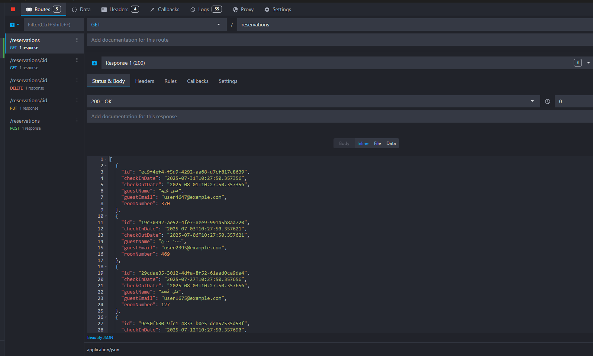
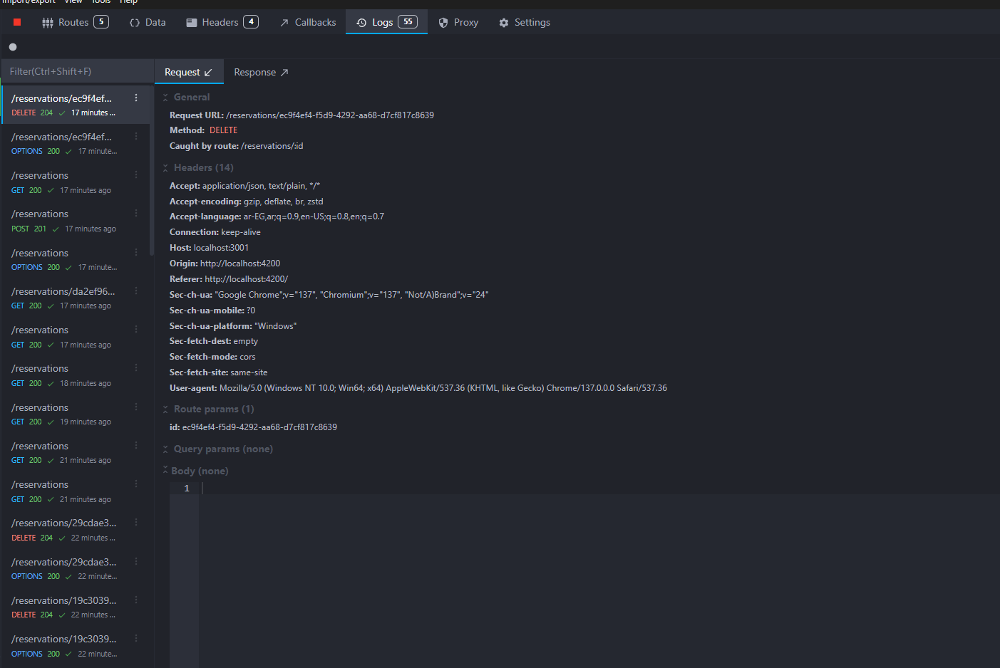
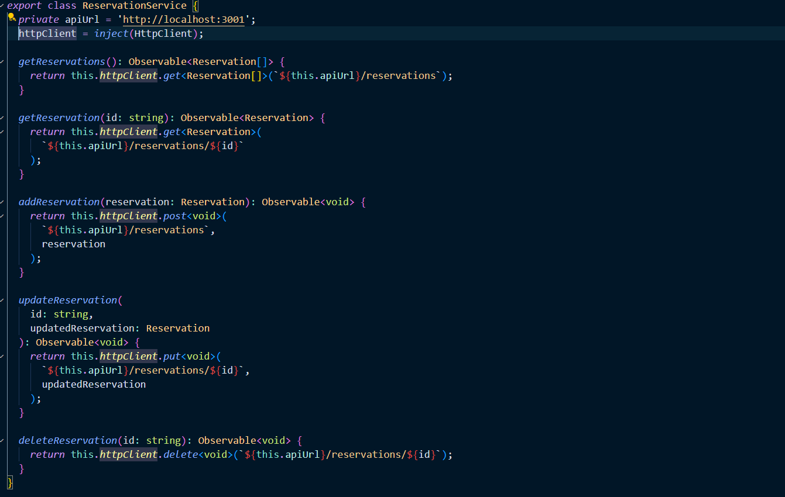

# 🚀 Day 3 – Reactive Programming with Observables & HTTP

A hands-on Angular app focusing on **Observables**, **HttpClient**, and integrating with a mock backend using **Mockoon**.

---

## 📌 Features

- ✅ Fetch reservations data from a **Mock API (Mockoon)**
- ✅ Create new reservations via **HTTP POST**
- ✅ Edit existing reservations via **HTTP PUT**
- ✅ Delete reservations via **HTTP DELETE**
- ✅ View all reservations using **HTTP GET**

---

## 📅 Topics Covered

- ✅ Introduction to **Reactive Programming** with `Observable` and `RxJS`
- ✅ Using **HttpClient** to perform CRUD operations
- ✅ Handling **Async Data** with `subscribe`, `pipe`, and operators
- ✅ Creating and connecting to a **Mock REST API** using [Mockoon](https://mockoon.com/)

## 🖼️ Screenshots

